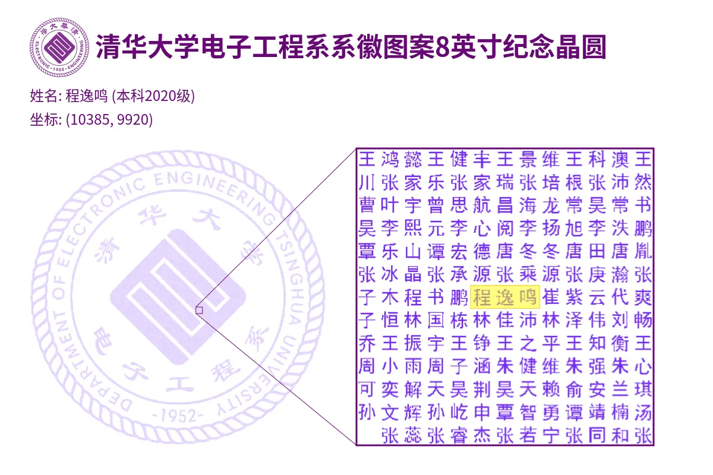

<!-- 欢迎区域 --> 

  <strong>欢迎光临 程逸鸣 的 </strong>
  

<!-- 名字动态打字效果 -->

  

<!-- 徽章区域 -->

  
  
  

<!-- Wink 图片 -->
<!-- welcome -->
##  😉

  

<!-- Personal Tags 区域 -->
##  🏷️

<em><b>I love connecting with different people</b> so if you want to say <b>hi, I'll be happy to meet you more!</b> </em>
  

  

<!-- 技术栈展示 -->
<h3>💻 Things I code with</h3>

  <code></code>
  <code></code>
  <code></code>
  <code></code>
  <code></code>
  <code></code>
  <code></code>
  <code></code>
  <code></code>
  <code></code>
  <code></code>
  <code></code>
  <code></code>
  <code></code>
  <code></code>

<!-- 学校与组织 -->
<h3>🚀 Current or Previous Org</h3>

  <code></code>
  <code></code>
  <code></code>
  <code></code>
  <code></code>
  <code></code>
  <code></code>
  <code><img title="Argone" width="25" height="25" src="data:image/png;base64,iVBORw0KGgoAAAANSUhEUgAAAOEAAADhCAMAAAAJbSJIAAABjFBMVEX///9/zTP/Kg5osNMAAAAaEhTSIg84CIsCokR8udiop6eKiIhhrdEUCg2hJWnwxMLQAAD/KgC01ecrA43Q0NDz8/N5dneZmJj/AABPuEYMAAA3MjMQAgejoaFST1C2tbXd3Nzu7u7CwcFua2xFQULU09OCgIBlYmO/vr7h4eFzyRBeW1wuKCo/OzwAoTsoIiN60jP/8/J61TfJ6bFyyQpqt9caAIFMSEkiGx3tycL11NLR8MCZlwD/6ObKTiPlMBz/YFO845yRuzf1+/C9byr/NyCj2nWFyjjXLBr/qaPk9NivjC6L0UvfLxz/f3WfqTb/xL/QOB3FXCX/Szuw34u4fCyY1mP/l5Da8MmomjP/bmOYsjb/tbDq9uCfnir/UUz/h37/nZb/Pyv/c2g7szCzssiYAFMip1VJrJ5CSaJ9crTQ6dhfuntbsLZWaa6qn8kvqG5BGY+Ly55egrtDrItELpZmTqG03MBlmsjSy+JDsGdSWaeWh7xKP5x2YqpXr6+AxpVbe7c8qoGn1rVuXjYFAAAOm0lEQVR4nO1c6Z/jRhGVZ1sE7IjssJK1yLIly/fYM54ckzFZwmZZ9siyGwJZkhAScpGLO0AgBAKE/ONUdaulbl22bAbJ+fX7kLXdOup1VferKmmiaQoKCgoKCgoKCgoKCgoKCgoKCgoKCgoKCgpfCXznsUI8U7V9O+Pady8X4uqzVVu4KxpPfO9rBbh++FzVFu6IG0eN71/OJ3j34ODqi1XbuBNuHjUaT/wgn+L1g4PDW1UbuRNuNwB3ilwITny+ait3wL0jZHj6wzwn3jqgFKs2cwfcb1Cc/jib4ANK8ODwhart3BrXjkKGP8p2InMhOHFvFaPBka0Y10OCB4dvVm3plnh4GlHMUoy7BxH2VDFuHjViJ/40TfH6gYCqjd0KLzdEFLkQnPh21dZugXtHIsHTnyWdeOtAovh41faWx33JhY0nEorxQCJ4cPhu1faWxpNHMsPTn18ucCE4ce/KqARBcOJPcrcZ6sSXqra4JB4mCcqKcTdJEJz4etU2l8LNp9IMRcV4J83w4LBqo0vh5TRBwN0CF4ITX6na6hJ4NbUKZcVIbjP7pxh3Ml0YKcaDTIIHh69VbffGSCpFQjHuZrtwnxQjhyBXjJRSRE7cF8XIUAqOO5dztpnQifuhGG/kuhDiFBQjL0apF6s2fiNkKwXH3ZxtJnTiPihGtlJETvxFEcH9aGgUerBx+vDNwyKGe9ACv1Howsap9szVYic+VjWDNbhZTPDoSU17t9iJ71RNYQ1uFwfpHTjk8TVOrHcL/N4aF97Dg95eQ7FqEoW4X0iwcZsdVUjw4OpblVIoxrU1LrzJDntxjRNrrBjFHjy9wY97aV8VY61ScDy7xol1bYGvU4pr8aEvFDuxri3wNUpxXzh0PxVjI6XgeH4NxVo2NDZTCo5bxXFax4emea0L7sKb8uHrFKOGDY3TYoI3ksc/V+zE+jU0HhYzbKRO2DfFyGpyiy68lj7lrWKKdVOM4taFpBQR1jixXg9Ni1sXjafeyDrp9X1SjJwmN8ft7LPeKd5s6vTQtKRScDy2P4qxhmBKKThe2xfFKGhyU+SeuC49rUsLvKjJjS58Nf/UV4op1qUFvkYpXi46tzBM69ICX6MUR5lKwbEXilHswdOHxWe/dFiIOjw0ffWX3y7Et4rx3vvfLML7dXDiB18vwMmHjxbj7KMrRfhV1ewQvz4pYPjBpXV49JECPG1VzY7iN/kUT367luHZ7woI/r5qbgw3cxme/GEtQUA+w4+rpsbxxzyKJ2cbEDz7U64L/1Y1swg5DE/+vIkLL519ksPwL1XzivHXHIobEbx06dMcF86q5iXgs0wXfrghw7OPsghe+UfVrERkKsZ6peDIVIwrVZOSkaEYGyhF5MQMxaiLUnCkFWMzpeAU0x6sjVJwpBRjI6WIkFKMGikFx3ZKETnx8/oqBUdSMUoRTCnG0/2q+WRAUoyTf5VkePb3+ioFh6QYn5UkeElOT2umFBz/jimWUIrIiV8IMfpe1VxyEDE8+U95F146+zhi+EnVTPLwJadYTik4IsWooVJwlE1IE04MFePKP6vmkQ++2WxFMFKMWioFx2dbKUXkRKoYT9dSKTgwPT3ZQik4aqwUHKAYWyhF5MQvaqwUHCdbKUVE8ZNHPq+awTp8uZ1ScHxaY6Xg+PAbO6Fmda+CgoKCgoLCVwhWH1C1EReKcwIYVW3FBaJPdF0n7arNuEB0kaFOqjbjArEwdAMYTqu248LgE90YGro7r9qQC8OY6MSEQCVf2e0UXGhoHUMn3aotuSBMwYVjzQaenapNuSDMHQhSXIw68au25UJggfMcjW6opCWN9IMgoGmAOT5eDfmvfrfd6xzPx3bXCxiEl+9MezLsnA9sKXvw4Rj25sx0PFwuz8eBMIgXoB9m3cli2Zl0U5tBvwk3HE5sc1uGTcKYoSjKkmhCogP7q9UjxHB67DdvQYjjGoZLYkTv/djwxYExB05oxtcZw89Neif4nZ66iF8VwgsgjTk91YBTE9M8gQNcOmB42zHELcbXWGJDxNkFhroz0PqOA+kAkxJrSEA6KS0XkwTYogyDMxwZmDg4aCkMkE7kjBbMIRjXI/RUerV4VuAciKAAfsZJMzDzmAg2eDDAbog33krPUAwX9FPP1R3x4sgQJnTh6oQ5EyYBb3dse8G020OOxjnG9iy0hZIftFoDHS11I/FBhlPtmMAMjG27jRzdRczQWAFBmJmebdtDmj/GvqKBpduBGdgr/NjbgiHevhuaCJcQX2hFht0uGDYeWRaaaxi6s+BLbAbWuPEdAzx7GcaAeQzf3JVwC79NXDdMmuZESKAw24CtgEz60WUMXbqoHX6xxS8lACHFJxuvICwfyhA84/jh9zZQGgrj526crlt4shBEA8EcGqXEXUSzBxwg/PlNnfbAiS33hD3dglgQHNpMumAjBIIj2hCDxzJDF27OCc6SN6CswgU1cWT22tCNjgaGRs8VToXYM5YRQ6Mn7S5OPM8tqtQxYB2Vz0oGTjxLpmAx/76Ib26TpJzAlISTP0slfbM4IloYeWJe7wvbNo5FdLlFdjQm7e4BhnRZhtJFdFkSTWpZNPWQnCeqZC8KAExtE/UlTHg4SBmKwWEJ0UC3FrGqsSPHeRjBWvK8UvRoaEcrgoWTEw8iQydeW+lVMIqiDccSPQIvMgcZEknLZIaGK451I17oTUm+tESQbQL0S5wr0MiKv5ry1pOeQJ8z9DMmdxaZ00rNjcxQWmt00hlDWJFOuyXCkezbBDPZadqxIbrUlD2Trq9MHqUYrufJi0fT1Uol9QmGUukdMbTCBEKAXpphcvNoSr4w5bnXjeTlu/z0VnLF8OOn2aMJhn4mwxkllEI5hrohx7UlrRhTjj2oQQQHIxacczu1zWosHfRChonRBEMpgiOGdKNrJpHOzItgpnZfWNxxuJmCbGmyFlPEsraeoZyLbMzQ0XYD6Jk7aXZjNNuOsNiSE4CJZ5TghCHN9rp2QpoplkY4vAPDXft/hKb5IjDxj6wxpcSTNgNAH9t077GmmCRzx+FKm2gJRC7fkmHWBl0SHmHljwQh8U0yZH1V3NKWDpZPRhSZXTmeKWaiHm7DsL+F+iUAmbOx7MhYGPGGnGLI5gSnBZ1JOtG2FmTkxF4U41sy1FIFa1n0M6OAxP39FEPMC0mHxXNnLGzb/ZSq0Vw85LUtQ6xdUqu7DOysxYMZJuedZIgpjAFhY81myRoGXJ9wdz9OELZlaO+6EJdGViN/FEtikuHESaSXMWw532MH8/nbluFsy5KXY5QzQ3rkjiTDjPSaA1MFwxEs7Qo53rYMsTzJveMGyCh4KOzItgyGGWHNQCsk3Zcu0ozHtmPoJ7o2gDIFcCquQtDYoBdKMqRTaoy7HsPUFBOojoP76yCA32bNhbBf7cCQTpROhh69keU3J6REFwPkO+74SIBsi4lbeqdhKhFjEU+ptRBKAey6xbvg9gzpvickJU4ZgZy7eau4y5ORlFqMOoYuwSCGH40OaEYU/u4Ie9gODEFViXBPt0Rp0Zea1emhgcZ63sfSSM+QyhnKJb6IP+ADHbFlR3veidqCROEmfGTohnePvnfiG87LVRalERDXIF4/xCxo0d6uNAf+tNltBv9jMyzTg7JJXvYXAiw1VvJdes5O23nd4Brpp8TYT95Bk+uFZlaV28oR1b0ENpz95I8eSXY29hiZDw2aWcX9viKzHh3kJ+P7ByNjU8kuMfcVA7FJxWAtttlK6/H/3MkAe04jdhWmDmw+QqvbIhixZlh0EnpsiyU/+DON5tExZJf005w+bgwfaY/DNMau9HWQOaU4bProhH5gL/H5pdhttAg+IjDZLJgs9wrsMZnYXc7QJEa3y+qqiYMHhsyIw4K9WobaUE70DagkpH3UoooZMmzrPWb0jNWJjOEKt+M+MeDjRHdWnKFJJszzFTPEt0lcMc+fy+ZYxDZIf8QYkrbH4tIXGM5YejDH9Tw5bkMZyhi2SZ89Iq+aoWY1ewV5voXvNUxmlGFAAosZLTI02b40Rh6TJRQxmksZAs85FdvKGSJmoyAI/Kw8H3yo6aRLGU6IZfWo0TJDGtYT6kMDmNoLuliJZzXpYbVgmA9kGJAVZcj8jEaLDDXcVeE4fJo4ceiTEGQ4oQfjpmXv2OS+YCBD7ZxukR5p+qMRNVpi2Ca9wFvSQh0ZNgnNasnEH/lzJGcT26txjmRh7TEjuCsO6T7aQ6N93tailmMbwAnYIPxniXrYpF738OxWquSvF6hpFpVLZiX9xxIG4Z9RGIdWdLTVFw62rBoTVFBQUFBQUAC17vB+6rTDSndvqZNj9nzKhKpkQsW+syL8QL9D33fz9EWns8CXpq0xIR2a/LRXzmoAqcBgaOGzC///yCMfVtQcnhPW0WmScfeY5qUe0VsD9itZdOdhad9irQ6z3SbDMZxs6WTQcmmJNSB2G/9OIcCkj6ReC6wGEUOL9Fgh2CSjsOolS/qVfuxpmsHqfzgu7CezdnobCVu0ozEg+BWcvnC1bl2ejUQMm8R3l+yDabXQPI8VGLR9AQwt5pQRCcJWh8UY0rIKPGsyhuc4OCVTvfSrzxeEiOG5y8p4+lcy9EebPdlcoMmO3iMruiLHBI7w2KnIsM86b7TWGJDeivVuVmXfKb04cIZ9CFGfmgz2+2P81GXGGuhD55iEf0+CIcpaHYyhxf5ixGY+7ITdWa8uqzBm2KUlO768jetQwzo4oOttxNbh3GMxGbBGAC2a2C8ujdkOW4ez8AF0vz7P7ywyGZkQfp1lMJ0O0BHgw1mLGm8QexawBx/gqB6NuzaZTqctukJDhjY5H/mTcC+Fb/THWZ0Y0gf2M2rYCL1G1yFdWzMjeoMZfNqnnqMBatFd1go7rwPCn/lPCDoTT6gRQ80H9LX+iFbpIx8CzB+NeMk+CsL9wp9hw64P1T5dZz5VglHYvOvzP2ecjfANGl8cU1BQUFBQUFBQUFBQUFBQUFBQUFBQUFBQUKge/wXt6KMT/cOsfQAAAABJRU5ErkJggg=="></code>
  <code></code>
  <code></code>
  <code></code>
  <code></code>
  <code></code>

<!-- 学术兴趣 -->
### 📖 Academic Interests

<!-- 兴趣爱好 -->
### 🎮 Also fan in

<!-- 联系方式 -->
### ☎️ Contact me

<!-- 个人网站 -->
### 🌍 Learn More

<!-- GitHub 统计区域 -->
##  💻

<table width="100%" cellspacing="0" cellpadding="0">
  <!-- Snake 动画横幅，单独一行 -->
  <tr>
    <td colspan="2">
      <picture width="100%">
        <source width="100%" media="(prefers-color-scheme: dark)" srcset="https://raw.githubusercontent.com/EaminC/EaminC/output/github-contribution-grid-snake-dark.svg">
        <source width="100%" media="(prefers-color-scheme: light)" srcset="https://raw.githubusercontent.com/EaminC/EaminC/output/github-contribution-grid-snake.svg">
        
      </picture>
    </td>
  </tr>

  <!-- 主内容 -->
  <tr valign="top">
    <td width="42%" style="padding-right: 10px;">
      <!-- 语言使用图 -->
      
    </td>
    <td width="58%">
      <!-- 连续打卡图 -->
      <picture>
        <source media="(prefers-color-scheme: dark)" srcset="https://github-readme-streak-stats.herokuapp.com/?user=EaminC&theme=dark&hide_border=true" />
        <source media="(prefers-color-scheme: light)" srcset="https://github-readme-streak-stats.herokuapp.com/?user=EaminC&theme=light&hide_border=true" />
        
      </picture>
      <!-- 奖杯图 -->
      
      <!-- 总览图 -->
      
    </td>
  </tr>
</table>

This is fake

Polluted by recent project

Working on  and  mostly

<!-- Girlfriend -->
##  💍

  

  Thank you, my dearest love,Miss Yang ❤️

<!-- 最后感谢访问 -->
##  🎉

  

  The picture will be different everytime you <a href="https://github.com/EaminC">refresh   </a> !

<!-- 访客统计 -->
##  📉

  You are Visitor No. 
  

