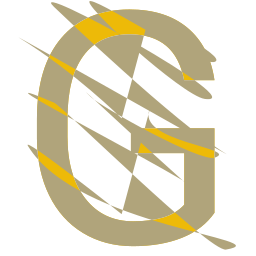
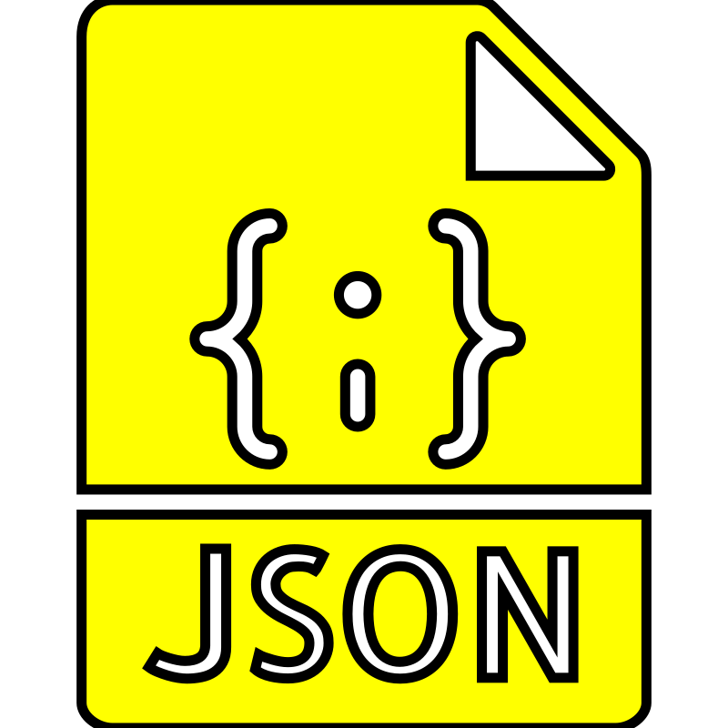

<!-- 欢迎区域 --> 

  <strong>欢迎光临 程逸鸣 的 </strong>
  

<!-- 名字动态打字效果 -->

  

<!-- 徽章区域 -->

  
  
  

<!-- Wink 图片 -->
<!-- welcome -->
##  😉

  

  The wink will be different everytime you <a href="https://github.com/EaminC">refresh  </a> !

  

<!-- Personal Tags 区域 -->
##  🏷️

<em><b>I love connecting with different people</b> so if you want to say <b>hi, I'll be happy to meet you more!</b> </em>

<!-- 技术栈展示 -->
<h3>💻 Things I code with</h3>

  <code></code>
  <code></code>
  <code></code>
  <code></code>
  <code></code>
  <code></code>
  <code></code>
  <code></code>
  <code></code>
  <code></code>
  <code></code>
  <code></code>
  <code></code>
  <code></code>
  <code></code>

<!-- 学校与组织 -->
<h3>🚀 Current or Previous Org</h3>

  <code></code>
  <code></code>
  <code></code>
  <code></code>
  <code></code>
  <code></code>
  <code></code>
  <code></code>
  <code></code>
  <code></code>
  <code></code>
  <code></code>

<!-- 学术兴趣 -->
### 📖 Academic Interests

<!-- 兴趣爱好 -->
### 🎮 Also fan in

<!-- 联系方式 -->
### ☎️ Contact me

<!-- 个人网站 -->
### 🌍 Learn More

  

<!-- GitHub 统计区域 -->
##  💻
<picture width="100%">
  <source width="100%" media="(prefers-color-scheme: dark)" srcset="https://raw.githubusercontent.com/EaminC/EaminC/output/github-contribution-grid-snake-dark.svg">
  <source width="100%" media="(prefers-color-scheme: light)" srcset="https://raw.githubusercontent.com/EaminC/EaminC/output/github-contribution-grid-snake.svg">
  
</picture>

<table width="100%">
  <tr valign="top">
    <td width="43%">
      <!-- 语言使用图 -->
      
    </td>
    <td width="57%">
      <!-- 连续打卡图 -->
      <picture>
        <source media="(prefers-color-scheme: dark)" srcset="https://github-readme-streak-stats.herokuapp.com/?user=EaminC&theme=dark&hide_border=true" />
        <source media="(prefers-color-scheme: light)" srcset="https://github-readme-streak-stats.herokuapp.com/?user=EaminC&theme=light&hide_border=true" />
        
      </picture>
       
      <!-- 奖杯图 -->
      
        
      <!-- 总览图 -->
      
    </td>
  </tr>
</table>

This is fake

Polluted by recent project

Working on  and  mostly

<!-- Girlfriend -->
##  💍

<!-- 最后感谢访问 -->
##  🎉

  

  The picture will be different everytime you <a href="https://github.com/EaminC">refresh   </a> !

<!-- 访客统计 -->
##  📉

  You are Visitor No. 
  

